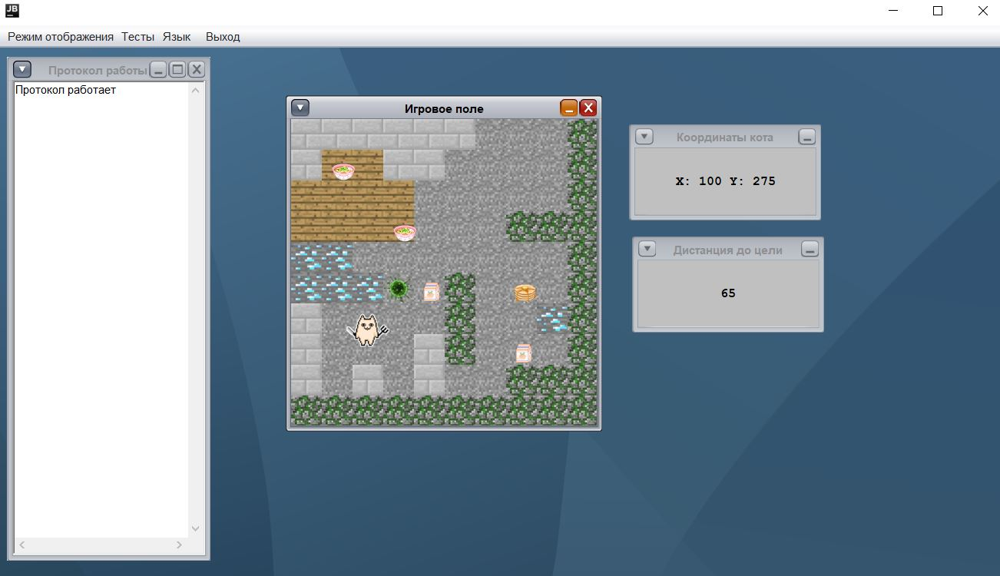
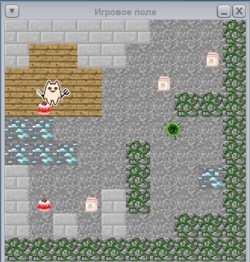
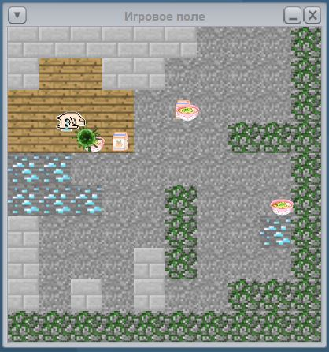
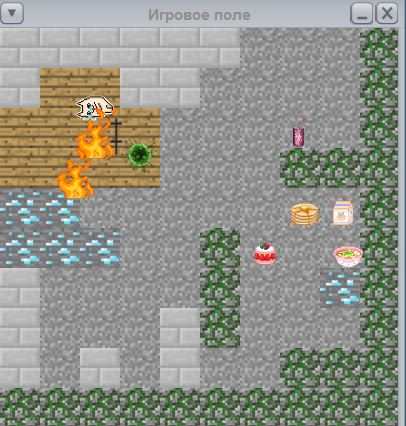

# Robots
The project to learn OO design concepts and MDI application development in Java

 

 
 

# TODO:
* [X] add maven
* [X] fix the menu creation method
* [X] fix LogWindowSource class
* [X] fix resource leak
___
* [X] fix bug with bounds
* [X] add closing dialog
* [X] add exit botton
* [X] create localization (using ResourceBundle)
___
* [X] remember states windows apps
* [X] restore states windows apps
* [X] create saved state warning
___
* [X] add some kinds of target and fix their behavior
* [X] add push-botton control of the robot
* [X] teach robot to eat targets
* [X] create a barrier
___
* [X] add new window with coordinates of the robot
* [X] add new window with distance between the robot and nearest target
* [X] separate logic of visualization and robot behavior
* [X] model of the robot -- observable
___
* [X] add enemies that will hunt the robot
* [X] teach the robot to shoot at enemies
* [X] teach enemies to die from shots
* [X] add maps and teach the robot to run by them
* [ ] use logs to describe actions
* [ ] add treasures
